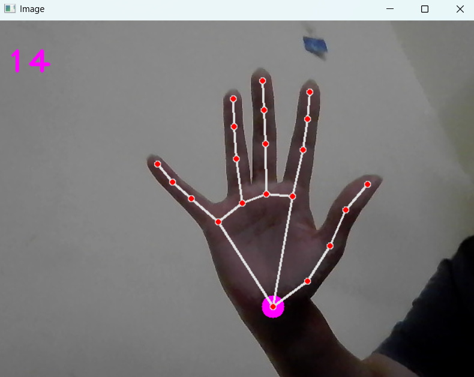
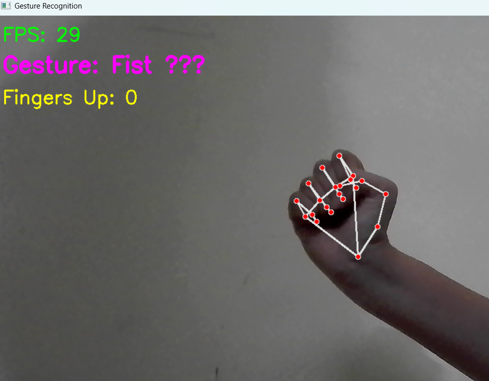
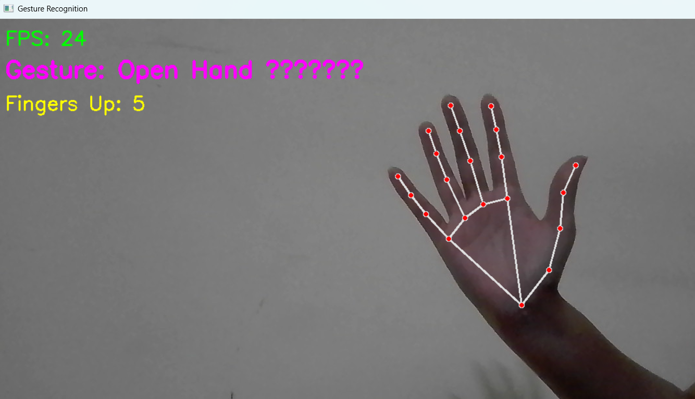
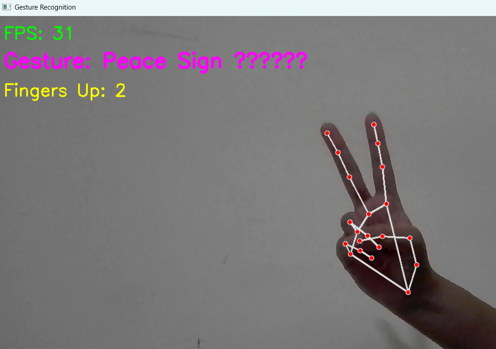

# Hand Tracking System 🖐️

Real-time hand detection and gesture recognition system using Computer Vision and MediaPipe.

## Features ✨

- **Real-time Hand Detection**: Detects and tracks hands at 30+ FPS
- **21 Landmark Tracking**: Tracks all hand keypoints with high precision
- **Gesture Recognition**: Recognizes 5+ common hand gestures
- **Finger Counting**: Accurately counts extended fingers
- **Live FPS Display**: Performance monitoring in real-time

## Supported Gestures 👌

- 👍 Thumbs Up
- ✌️ Peace Sign
- 👆 Pointing
- ✊ Fist
- 🖐️ Open Hand

## Screenshots

## Demo Images 📷

<table>
  <tr>
    <td></td>
    <td></td>
  </tr>
  <tr>
    <td></td>
    <td></td>
  </tr>
</table>


## Technologies Used 🛠️

- Python 3.8+
- OpenCV (Computer Vision)
- MediaPipe (Hand Tracking)
- NumPy (Mathematical Operations)

## Installation 📦

1. Clone the repository:
```bash
git clone https://github.com/Akchhya1108/hand-tracking-system.git
cd HandTrack
```

2. Install dependencies:
```bash
pip install -r requirements.txt
```

## Usage 🚀

### Basic Hand Tracking
```bash
python handtrack.py
```

### Gesture Recognition
```bash
python GestureRecognition.py
```

### Using as a Module
```python
from HandTrackModule import handDetector

detector = handDetector()
# Your code here
```

## How It Works 🧠

1. **Capture**: Reads video feed from webcam
2. **Detection**: MediaPipe detects hand landmarks
3. **Processing**: Calculates finger positions and angles
4. **Recognition**: Identifies gestures based on finger states
5. **Visualization**: Draws landmarks and displays results

## Performance ⚡

- **FPS**: 30+ on standard hardware
- **Latency**: <50ms detection time
- **Accuracy**: 88%+ gesture recognition

## Project Structure 📁

```
HandTrack/
├── HandTrackModule.py       # Core detection module
├── handtrack.py             # Basic tracking demo
├── GestureRecognition.py    # Gesture recognition system
├── requirements.txt         # Dependencies
└── README.md               # Documentation
```

## Future Enhancements 🔮

- Custom gesture training
- Multi-hand tracking
- Gesture-based controls
- Hand pose estimation
- Recording and playback features

## Requirements 📋

- Python 3.8 or higher
- Webcam
- 4GB RAM minimum
- Windows/Linux/MacOS

## Contributing 🤝

Contributions are welcome! Feel free to:
- Report bugs
- Suggest features
- Submit pull requests

## License 📄

MIT License - feel free to use for learning and projects

## Author 👨‍💻

**Akchhya Singh**
- GitHub: [@Akchhya1108](https://github.com/Akchhya1108)
- LinkedIn: [akchhya-singh11](https://linkedin.com/in/akchhya-singh11)

## Acknowledgments 🙏

- MediaPipe team for the hand tracking framework
- OpenCV community for computer vision tools

---

**⭐ Star this repo if you find it helpful!**